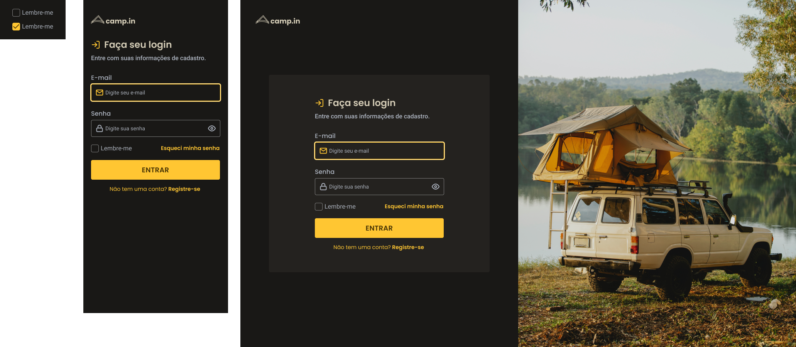

# Challenge: Login Form

## :computer: About the challenge

In this challenge you will create a login form.

### Layout

<div align="center">
	
</div>

## :rocket: Techs

- HTML
- CSS

## :art: Style Guide

### Colors:
```css
:root {
  --text-base: #afb6c2;
  --text-title: #d4ccb6;
  --background: #191816;
  --form-background: #24221f;
  --primary-color: #ffc632;
}
```

### Typography:

- font-family: Poppins
- font-weight: 400, 500, 600

- font-family: Roboto
- font-weight: 400, 500