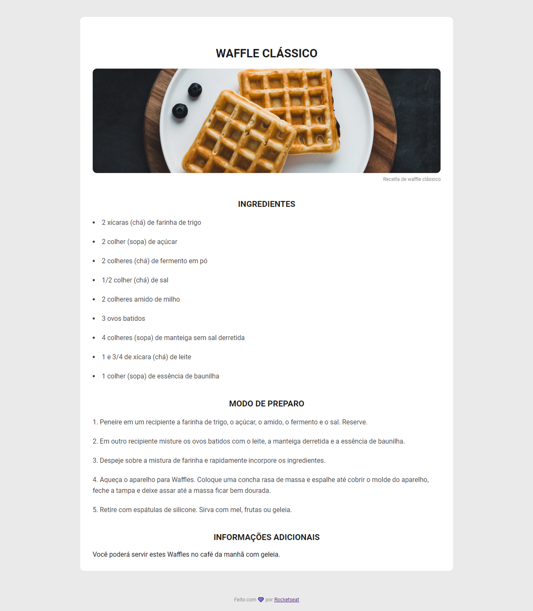

# Challenge: Recipe Page

## :computer: About the challenge

In this challenge you will have to create a recipe webpage with title, image, list of ingredients and method of preparation.

### Layout

<div align="center">
	
</div>

## :rocket: Techs

- HTML
- CSS

## :art: Style Guide

### Colors:
```css
:root {
  --body-bg-color: #EAEAEA;
  --recipe-bg-color: #FFFFFF;
  --text-color: #39393A;
  --title-color: #1B1B1B;
  --footer-color: #8F8F8F;
}
```

### Typography:

- font-family: Roboto
- font-weight: 400, 700