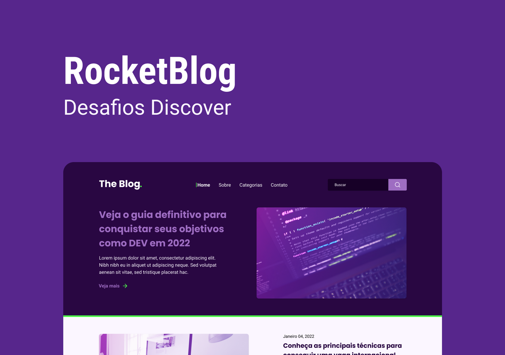
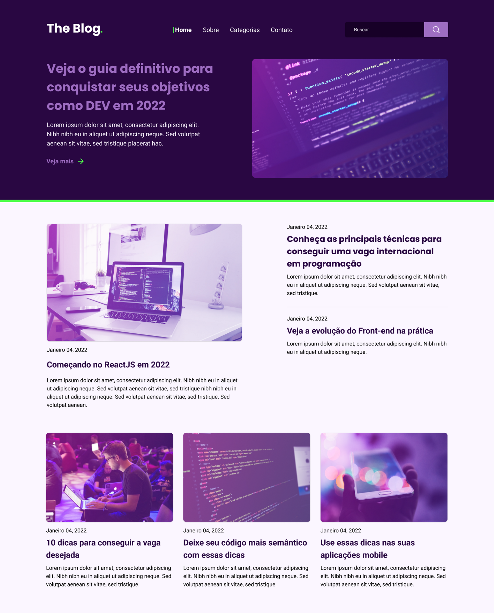

<div align="center">
  
</div>

# Challenge: RocketBlog

<br>

## :computer: About the challenge

In this challenge you will develop a homepage for a blog.

### Layout

<div align="center">
	
</div>

## :rocket: Techs

- HTML
- CSS

## :art: Style Guide

### Colors:
```css
:root {
  --purple-bg: #290742;
  --dark-bg: #170027;
  --button-bg: #9e6dc2;
  --white: #fff;
  --light-purple: #fbf6ff;
  --green: #4fff4b;
}
```

### Typography:

- font-family: Poppins;
- font-weight: 700;
- font-family: Roboto;
- font-weight: 400, 700;