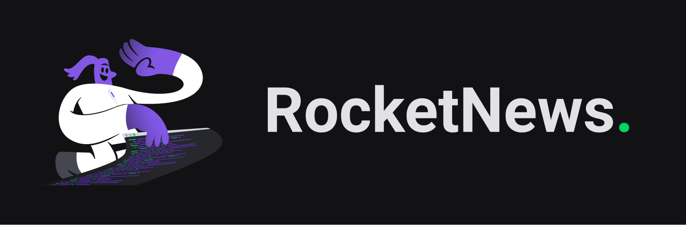
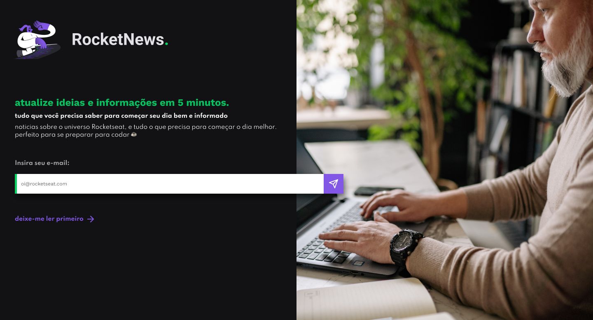

# Challenge: Portfolio

<div align="center">
	
</div>

## :computer: About the challenge

Develop a simple web page using HTML and CSS that will serve in the future for lead capture or newsletter subscription.

### Layout

<div align="center">
	
</div>

## :rocket: Techs

- HTML
- CSS

## :art: Style Guide

### Colors:
```css
:root {
  --body-bg-color: #121214;
  --text-color: #E1E1E6;
  --title-color: #04D361;
  --form-color: #A8A8A8;
  --bg-button-color: #8257e5;
}
```

### Typography:

- font-family: Spartan, Work Sans 
- font-weight: 400, 500, 700